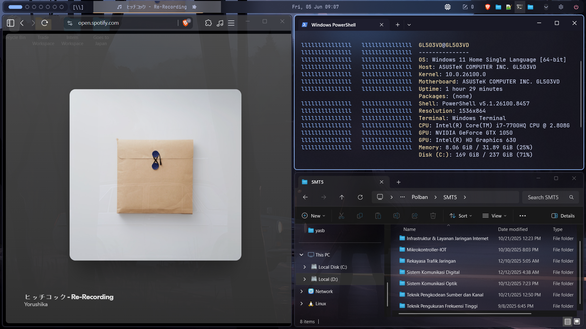
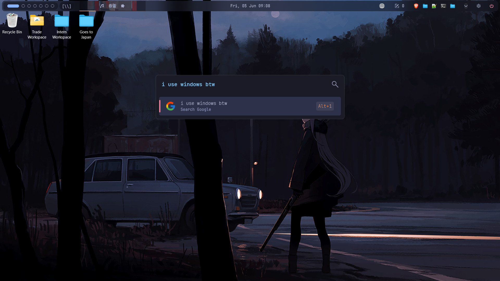

# dotfiles

you were born to use linux but forced to use windows? i got you. anyway, you can jump to: [preview](#preview) · [components](#components) · [setup](#setup) · [prerequisites](#prerequisites) · [install dependencies](#install-dependencies) · [apply config](#apply-config) · [credits](#credits)

## preview



[](https://youtu.be/wwuWRU4wgBU)

---

## components

| tool | purpose |
|---|---|
| [komorebi](https://github.com/LGUG2Z/komorebi) | tiling window manager |
| [yasb](https://github.com/amnweb/yasb) | status bar |
| [whkd](https://github.com/LGUG2Z/whkd) | hotkey daemon |
| [windows terminal](https://github.com/microsoft/terminal) | terminal |
| [flow launcher](https://github.com/Flow-Launcher/Flow.Launcher) | app launcher |
| [windhawk](https://windhawk.net) | system tweaks |
| [winfetch](https://github.com/lptstr/winfetch) | system info |
| [cursors](https://vsthemes.org/en/cursors/anime/70655-miyabi-zzz.html) | cursor theme |
| [ExplorerBlurMica](https://github.com/Maplespe/ExplorerBlurMica) | explorer blur effect |

---

## setup

### prerequisites

- Windows 10/11
- [Scoop](https://scoop.sh) (recommended for installing most tools)

```powershell
Set-ExecutionPolicy RemoteSigned -Scope CurrentUser
irm get.scoop.sh | iex
```

### install dependencies

```powershell
scoop bucket add extras
scoop install komorebi whkd
```

Install the rest manually via their respective GitHub releases or official sites.

### apply config

Clone the repo:

```powershell
git clone https://github.com/yourusername/dotfiles $env:USERPROFILE/dotfiles
```

Symlink or copy each config to its expected path. Example for komorebi:

```powershell
Copy-Item $env:USERPROFILE/dotfiles/komorebi/komorebi.json $env:USERPROFILE/komorebi.json
Copy-Item $env:USERPROFILE/dotfiles/komorebi/applications.json $env:USERPROFILE/applications.json
```

Repeat for each component. Expected paths per tool:

| tool | config path |
|---|---|
| komorebi | `%USERPROFILE%\komorebi.json` |
| yasb | `%USERPROFILE%\.config\yasb\` |
| windows terminal | `%LOCALAPPDATA%\Packages\Microsoft.WindowsTerminal_...\LocalState\settings.json` |
| flow launcher | `%APPDATA%\FlowLauncher\Settings\Settings.json` |
| winfetch | `%USERPROFILE%\.config\winfetch\config.ps1` |

### start komorebi

```powershell
komorebic start --whkd
```

---

## credits

Inspired by:
- [repo name](link)
- [repo name](link)

---

## license

MIT
